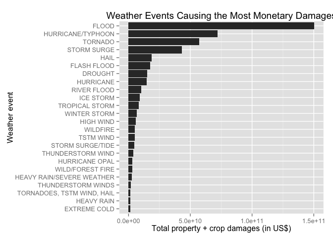

# Analysis of NOAA Storm Data
John ARNZEN  
## Synopsis

Our task for this assignment was to analyze the NOAA Storm Data database of the United States, looking for the types of weather events which most cause the most monetary damages to property and crops, and the weather events which cause the most fatalities and injuries.

The data stretch from 1950 to 2011 with a wide variety of variations of data quality and number of observations through the years. Minimal attempts were made to clarify the data due to scope and time---this should be considered a first pass at an analysis.

That said, we found that flooding and tornadoes were the most impactful culprits of the weather events across the US over the duration analyzed. Flooding caused the most property and crop damages, while tornadoes caused the most fatalities and injuries.

## Data Processing


```r
## load the libraries we'll use to process the data
library(data.table, warn.conflicts = FALSE)
library(dplyr, warn.conflicts = FALSE)
library(ggplot2, warn.conflicts = FALSE)
```


```r
## read the compressed data into a data frame
df_orig <- read.csv("StormData.csv.bz2")

## check the structure of the data and review their column names
str(df_orig)
```

```
## 'data.frame':	902297 obs. of  37 variables:
##  $ STATE__   : num  1 1 1 1 1 1 1 1 1 1 ...
##  $ BGN_DATE  : Factor w/ 16335 levels "1/1/1966 0:00:00",..: 6523 6523 4242 11116 2224 2224 2260 383 3980 3980 ...
##  $ BGN_TIME  : Factor w/ 3608 levels "00:00:00 AM",..: 272 287 2705 1683 2584 3186 242 1683 3186 3186 ...
##  $ TIME_ZONE : Factor w/ 22 levels "ADT","AKS","AST",..: 7 7 7 7 7 7 7 7 7 7 ...
##  $ COUNTY    : num  97 3 57 89 43 77 9 123 125 57 ...
##  $ COUNTYNAME: Factor w/ 29601 levels "","5NM E OF MACKINAC BRIDGE TO PRESQUE ISLE LT MI",..: 13513 1873 4598 10592 4372 10094 1973 23873 24418 4598 ...
##  $ STATE     : Factor w/ 72 levels "AK","AL","AM",..: 2 2 2 2 2 2 2 2 2 2 ...
##  $ EVTYPE    : Factor w/ 985 levels "   HIGH SURF ADVISORY",..: 834 834 834 834 834 834 834 834 834 834 ...
##  $ BGN_RANGE : num  0 0 0 0 0 0 0 0 0 0 ...
##  $ BGN_AZI   : Factor w/ 35 levels "","  N"," NW",..: 1 1 1 1 1 1 1 1 1 1 ...
##  $ BGN_LOCATI: Factor w/ 54429 levels ""," Christiansburg",..: 1 1 1 1 1 1 1 1 1 1 ...
##  $ END_DATE  : Factor w/ 6663 levels "","1/1/1993 0:00:00",..: 1 1 1 1 1 1 1 1 1 1 ...
##  $ END_TIME  : Factor w/ 3647 levels ""," 0900CST",..: 1 1 1 1 1 1 1 1 1 1 ...
##  $ COUNTY_END: num  0 0 0 0 0 0 0 0 0 0 ...
##  $ COUNTYENDN: logi  NA NA NA NA NA NA ...
##  $ END_RANGE : num  0 0 0 0 0 0 0 0 0 0 ...
##  $ END_AZI   : Factor w/ 24 levels "","E","ENE","ESE",..: 1 1 1 1 1 1 1 1 1 1 ...
##  $ END_LOCATI: Factor w/ 34506 levels ""," CANTON"," TULIA",..: 1 1 1 1 1 1 1 1 1 1 ...
##  $ LENGTH    : num  14 2 0.1 0 0 1.5 1.5 0 3.3 2.3 ...
##  $ WIDTH     : num  100 150 123 100 150 177 33 33 100 100 ...
##  $ F         : int  3 2 2 2 2 2 2 1 3 3 ...
##  $ MAG       : num  0 0 0 0 0 0 0 0 0 0 ...
##  $ FATALITIES: num  0 0 0 0 0 0 0 0 1 0 ...
##  $ INJURIES  : num  15 0 2 2 2 6 1 0 14 0 ...
##  $ PROPDMG   : num  25 2.5 25 2.5 2.5 2.5 2.5 2.5 25 25 ...
##  $ PROPDMGEXP: Factor w/ 19 levels "","-","?","+",..: 17 17 17 17 17 17 17 17 17 17 ...
##  $ CROPDMG   : num  0 0 0 0 0 0 0 0 0 0 ...
##  $ CROPDMGEXP: Factor w/ 9 levels "","?","0","2",..: 1 1 1 1 1 1 1 1 1 1 ...
##  $ WFO       : Factor w/ 542 levels ""," CI","%SD",..: 1 1 1 1 1 1 1 1 1 1 ...
##  $ STATEOFFIC: Factor w/ 250 levels "","ALABAMA, Central",..: 1 1 1 1 1 1 1 1 1 1 ...
##  $ ZONENAMES : Factor w/ 25112 levels "","                                                                                                                               "| __truncated__,..: 1 1 1 1 1 1 1 1 1 1 ...
##  $ LATITUDE  : num  3040 3042 3340 3458 3412 ...
##  $ LONGITUDE : num  8812 8755 8742 8626 8642 ...
##  $ LATITUDE_E: num  3051 0 0 0 0 ...
##  $ LONGITUDE_: num  8806 0 0 0 0 ...
##  $ REMARKS   : Factor w/ 436781 levels "","\t","\t\t",..: 1 1 1 1 1 1 1 1 1 1 ...
##  $ REFNUM    : num  1 2 3 4 5 6 7 8 9 10 ...
```

```r
## quick summary of the data (mostly to identify columns with NAs 
## and other anomolies)
summary(df_orig)
```

```
##     STATE__                  BGN_DATE             BGN_TIME     
##  Min.   : 1.0   5/25/2011 0:00:00:  1202   12:00:00 AM: 10163  
##  1st Qu.:19.0   4/27/2011 0:00:00:  1193   06:00:00 PM:  7350  
##  Median :30.0   6/9/2011 0:00:00 :  1030   04:00:00 PM:  7261  
##  Mean   :31.2   5/30/2004 0:00:00:  1016   05:00:00 PM:  6891  
##  3rd Qu.:45.0   4/4/2011 0:00:00 :  1009   12:00:00 PM:  6703  
##  Max.   :95.0   4/2/2006 0:00:00 :   981   03:00:00 PM:  6700  
##                 (Other)          :895866   (Other)    :857229  
##    TIME_ZONE          COUNTY           COUNTYNAME         STATE       
##  CST    :547493   Min.   :  0.0   JEFFERSON :  7840   TX     : 83728  
##  EST    :245558   1st Qu.: 31.0   WASHINGTON:  7603   KS     : 53440  
##  MST    : 68390   Median : 75.0   JACKSON   :  6660   OK     : 46802  
##  PST    : 28302   Mean   :100.6   FRANKLIN  :  6256   MO     : 35648  
##  AST    :  6360   3rd Qu.:131.0   LINCOLN   :  5937   IA     : 31069  
##  HST    :  2563   Max.   :873.0   MADISON   :  5632   NE     : 30271  
##  (Other):  3631                   (Other)   :862369   (Other):621339  
##                EVTYPE         BGN_RANGE           BGN_AZI      
##  HAIL             :288661   Min.   :   0.000          :547332  
##  TSTM WIND        :219940   1st Qu.:   0.000   N      : 86752  
##  THUNDERSTORM WIND: 82563   Median :   0.000   W      : 38446  
##  TORNADO          : 60652   Mean   :   1.484   S      : 37558  
##  FLASH FLOOD      : 54277   3rd Qu.:   1.000   E      : 33178  
##  FLOOD            : 25326   Max.   :3749.000   NW     : 24041  
##  (Other)          :170878                      (Other):134990  
##          BGN_LOCATI                  END_DATE             END_TIME     
##               :287743                    :243411              :238978  
##  COUNTYWIDE   : 19680   4/27/2011 0:00:00:  1214   06:00:00 PM:  9802  
##  Countywide   :   993   5/25/2011 0:00:00:  1196   05:00:00 PM:  8314  
##  SPRINGFIELD  :   843   6/9/2011 0:00:00 :  1021   04:00:00 PM:  8104  
##  SOUTH PORTION:   810   4/4/2011 0:00:00 :  1007   12:00:00 PM:  7483  
##  NORTH PORTION:   784   5/30/2004 0:00:00:   998   11:59:00 PM:  7184  
##  (Other)      :591444   (Other)          :653450   (Other)    :622432  
##    COUNTY_END COUNTYENDN       END_RANGE           END_AZI      
##  Min.   :0    Mode:logical   Min.   :  0.0000          :724837  
##  1st Qu.:0    NA's:902297    1st Qu.:  0.0000   N      : 28082  
##  Median :0                   Median :  0.0000   S      : 22510  
##  Mean   :0                   Mean   :  0.9862   W      : 20119  
##  3rd Qu.:0                   3rd Qu.:  0.0000   E      : 20047  
##  Max.   :0                   Max.   :925.0000   NE     : 14606  
##                                                 (Other): 72096  
##            END_LOCATI         LENGTH              WIDTH         
##                 :499225   Min.   :   0.0000   Min.   :   0.000  
##  COUNTYWIDE     : 19731   1st Qu.:   0.0000   1st Qu.:   0.000  
##  SOUTH PORTION  :   833   Median :   0.0000   Median :   0.000  
##  NORTH PORTION  :   780   Mean   :   0.2301   Mean   :   7.503  
##  CENTRAL PORTION:   617   3rd Qu.:   0.0000   3rd Qu.:   0.000  
##  SPRINGFIELD    :   575   Max.   :2315.0000   Max.   :4400.000  
##  (Other)        :380536                                         
##        F               MAG            FATALITIES          INJURIES        
##  Min.   :0.0      Min.   :    0.0   Min.   :  0.0000   Min.   :   0.0000  
##  1st Qu.:0.0      1st Qu.:    0.0   1st Qu.:  0.0000   1st Qu.:   0.0000  
##  Median :1.0      Median :   50.0   Median :  0.0000   Median :   0.0000  
##  Mean   :0.9      Mean   :   46.9   Mean   :  0.0168   Mean   :   0.1557  
##  3rd Qu.:1.0      3rd Qu.:   75.0   3rd Qu.:  0.0000   3rd Qu.:   0.0000  
##  Max.   :5.0      Max.   :22000.0   Max.   :583.0000   Max.   :1700.0000  
##  NA's   :843563                                                           
##     PROPDMG          PROPDMGEXP        CROPDMG          CROPDMGEXP    
##  Min.   :   0.00          :465934   Min.   :  0.000          :618413  
##  1st Qu.:   0.00   K      :424665   1st Qu.:  0.000   K      :281832  
##  Median :   0.00   M      : 11330   Median :  0.000   M      :  1994  
##  Mean   :  12.06   0      :   216   Mean   :  1.527   k      :    21  
##  3rd Qu.:   0.50   B      :    40   3rd Qu.:  0.000   0      :    19  
##  Max.   :5000.00   5      :    28   Max.   :990.000   B      :     9  
##                    (Other):    84                     (Other):     9  
##       WFO                                       STATEOFFIC    
##         :142069                                      :248769  
##  OUN    : 17393   TEXAS, North                       : 12193  
##  JAN    : 13889   ARKANSAS, Central and North Central: 11738  
##  LWX    : 13174   IOWA, Central                      : 11345  
##  PHI    : 12551   KANSAS, Southwest                  : 11212  
##  TSA    : 12483   GEORGIA, North and Central         : 11120  
##  (Other):690738   (Other)                            :595920  
##                                                                                                                                                                                                     ZONENAMES     
##                                                                                                                                                                                                          :594029  
##                                                                                                                                                                                                          :205988  
##  GREATER RENO / CARSON CITY / M - GREATER RENO / CARSON CITY / M                                                                                                                                         :   639  
##  GREATER LAKE TAHOE AREA - GREATER LAKE TAHOE AREA                                                                                                                                                       :   592  
##  JEFFERSON - JEFFERSON                                                                                                                                                                                   :   303  
##  MADISON - MADISON                                                                                                                                                                                       :   302  
##  (Other)                                                                                                                                                                                                 :100444  
##     LATITUDE      LONGITUDE        LATITUDE_E     LONGITUDE_    
##  Min.   :   0   Min.   :-14451   Min.   :   0   Min.   :-14455  
##  1st Qu.:2802   1st Qu.:  7247   1st Qu.:   0   1st Qu.:     0  
##  Median :3540   Median :  8707   Median :   0   Median :     0  
##  Mean   :2875   Mean   :  6940   Mean   :1452   Mean   :  3509  
##  3rd Qu.:4019   3rd Qu.:  9605   3rd Qu.:3549   3rd Qu.:  8735  
##  Max.   :9706   Max.   : 17124   Max.   :9706   Max.   :106220  
##  NA's   :47                      NA's   :40                     
##                                            REMARKS           REFNUM      
##                                                :287433   Min.   :     1  
##                                                : 24013   1st Qu.:225575  
##  Trees down.\n                                 :  1110   Median :451149  
##  Several trees were blown down.\n              :   568   Mean   :451149  
##  Trees were downed.\n                          :   446   3rd Qu.:676723  
##  Large trees and power lines were blown down.\n:   432   Max.   :902297  
##  (Other)                                       :588295
```


```r
## turn the data frame into a data table for faster & easier processing
dt <- as.data.table(df_orig)
```


```r
## what are the levels of EVTYPE?
levels(dt$EVTYPE)
```

```
##   [1] "   HIGH SURF ADVISORY"          " COASTAL FLOOD"                
##   [3] " FLASH FLOOD"                   " LIGHTNING"                    
##   [5] " TSTM WIND"                     " TSTM WIND (G45)"              
##   [7] " WATERSPOUT"                    " WIND"                         
##   [9] "?"                              "ABNORMAL WARMTH"               
##  [11] "ABNORMALLY DRY"                 "ABNORMALLY WET"                
##  [13] "ACCUMULATED SNOWFALL"           "AGRICULTURAL FREEZE"           
##  [15] "APACHE COUNTY"                  "ASTRONOMICAL HIGH TIDE"        
##  [17] "ASTRONOMICAL LOW TIDE"          "AVALANCE"                      
##  [19] "AVALANCHE"                      "BEACH EROSIN"                  
##  [21] "Beach Erosion"                  "BEACH EROSION"                 
##  [23] "BEACH EROSION/COASTAL FLOOD"    "BEACH FLOOD"                   
##  [25] "BELOW NORMAL PRECIPITATION"     "BITTER WIND CHILL"             
##  [27] "BITTER WIND CHILL TEMPERATURES" "Black Ice"                     
##  [29] "BLACK ICE"                      "BLIZZARD"                      
##  [31] "BLIZZARD AND EXTREME WIND CHIL" "BLIZZARD AND HEAVY SNOW"       
##  [33] "Blizzard Summary"               "BLIZZARD WEATHER"              
##  [35] "BLIZZARD/FREEZING RAIN"         "BLIZZARD/HEAVY SNOW"           
##  [37] "BLIZZARD/HIGH WIND"             "BLIZZARD/WINTER STORM"         
##  [39] "BLOW-OUT TIDE"                  "BLOW-OUT TIDES"                
##  [41] "BLOWING DUST"                   "blowing snow"                  
##  [43] "Blowing Snow"                   "BLOWING SNOW"                  
##  [45] "BLOWING SNOW & EXTREME WIND CH" "BLOWING SNOW- EXTREME WIND CHI"
##  [47] "BLOWING SNOW/EXTREME WIND CHIL" "BREAKUP FLOODING"              
##  [49] "BRUSH FIRE"                     "BRUSH FIRES"                   
##  [51] "COASTAL  FLOODING/EROSION"      "COASTAL EROSION"               
##  [53] "Coastal Flood"                  "COASTAL FLOOD"                 
##  [55] "coastal flooding"               "Coastal Flooding"              
##  [57] "COASTAL FLOODING"               "COASTAL FLOODING/EROSION"      
##  [59] "Coastal Storm"                  "COASTAL STORM"                 
##  [61] "COASTAL SURGE"                  "COASTAL/TIDAL FLOOD"           
##  [63] "COASTALFLOOD"                   "COASTALSTORM"                  
##  [65] "Cold"                           "COLD"                          
##  [67] "COLD AIR FUNNEL"                "COLD AIR FUNNELS"              
##  [69] "COLD AIR TORNADO"               "Cold and Frost"                
##  [71] "COLD AND FROST"                 "COLD AND SNOW"                 
##  [73] "COLD AND WET CONDITIONS"        "Cold Temperature"              
##  [75] "COLD TEMPERATURES"              "COLD WAVE"                     
##  [77] "COLD WEATHER"                   "COLD WIND CHILL TEMPERATURES"  
##  [79] "COLD/WIND CHILL"                "COLD/WINDS"                    
##  [81] "COOL AND WET"                   "COOL SPELL"                    
##  [83] "CSTL FLOODING/EROSION"          "DAM BREAK"                     
##  [85] "DAM FAILURE"                    "Damaging Freeze"               
##  [87] "DAMAGING FREEZE"                "DEEP HAIL"                     
##  [89] "DENSE FOG"                      "DENSE SMOKE"                   
##  [91] "DOWNBURST"                      "DOWNBURST WINDS"               
##  [93] "DRIEST MONTH"                   "Drifting Snow"                 
##  [95] "DROUGHT"                        "DROUGHT/EXCESSIVE HEAT"        
##  [97] "DROWNING"                       "DRY"                           
##  [99] "DRY CONDITIONS"                 "DRY HOT WEATHER"               
## [101] "DRY MICROBURST"                 "DRY MICROBURST 50"             
## [103] "DRY MICROBURST 53"              "DRY MICROBURST 58"             
## [105] "DRY MICROBURST 61"              "DRY MICROBURST 84"             
## [107] "DRY MICROBURST WINDS"           "DRY MIRCOBURST WINDS"          
## [109] "DRY PATTERN"                    "DRY SPELL"                     
## [111] "DRY WEATHER"                    "DRYNESS"                       
## [113] "DUST DEVEL"                     "Dust Devil"                    
## [115] "DUST DEVIL"                     "DUST DEVIL WATERSPOUT"         
## [117] "DUST STORM"                     "DUST STORM/HIGH WINDS"         
## [119] "DUSTSTORM"                      "EARLY FREEZE"                  
## [121] "Early Frost"                    "EARLY FROST"                   
## [123] "EARLY RAIN"                     "EARLY SNOW"                    
## [125] "Early snowfall"                 "EARLY SNOWFALL"                
## [127] "Erosion/Cstl Flood"             "EXCESSIVE"                     
## [129] "Excessive Cold"                 "EXCESSIVE HEAT"                
## [131] "EXCESSIVE HEAT/DROUGHT"         "EXCESSIVE PRECIPITATION"       
## [133] "EXCESSIVE RAIN"                 "EXCESSIVE RAINFALL"            
## [135] "EXCESSIVE SNOW"                 "EXCESSIVE WETNESS"             
## [137] "EXCESSIVELY DRY"                "Extended Cold"                 
## [139] "Extreme Cold"                   "EXTREME COLD"                  
## [141] "EXTREME COLD/WIND CHILL"        "EXTREME HEAT"                  
## [143] "EXTREME WIND CHILL"             "EXTREME WIND CHILL/BLOWING SNO"
## [145] "EXTREME WIND CHILLS"            "EXTREME WINDCHILL"             
## [147] "EXTREME WINDCHILL TEMPERATURES" "EXTREME/RECORD COLD"           
## [149] "EXTREMELY WET"                  "FALLING SNOW/ICE"              
## [151] "FIRST FROST"                    "FIRST SNOW"                    
## [153] "FLASH FLOOD"                    "FLASH FLOOD - HEAVY RAIN"      
## [155] "FLASH FLOOD FROM ICE JAMS"      "FLASH FLOOD LANDSLIDES"        
## [157] "FLASH FLOOD WINDS"              "FLASH FLOOD/"                  
## [159] "FLASH FLOOD/ FLOOD"             "FLASH FLOOD/ STREET"           
## [161] "FLASH FLOOD/FLOOD"              "FLASH FLOOD/HEAVY RAIN"        
## [163] "FLASH FLOOD/LANDSLIDE"          "FLASH FLOODING"                
## [165] "FLASH FLOODING/FLOOD"           "FLASH FLOODING/THUNDERSTORM WI"
## [167] "FLASH FLOODS"                   "FLASH FLOOODING"               
## [169] "Flood"                          "FLOOD"                         
## [171] "FLOOD & HEAVY RAIN"             "FLOOD FLASH"                   
## [173] "FLOOD FLOOD/FLASH"              "FLOOD WATCH/"                  
## [175] "FLOOD/FLASH"                    "Flood/Flash Flood"             
## [177] "FLOOD/FLASH FLOOD"              "FLOOD/FLASH FLOODING"          
## [179] "FLOOD/FLASH/FLOOD"              "FLOOD/FLASHFLOOD"              
## [181] "FLOOD/RAIN/WIND"                "FLOOD/RAIN/WINDS"              
## [183] "FLOOD/RIVER FLOOD"              "Flood/Strong Wind"             
## [185] "FLOODING"                       "FLOODING/HEAVY RAIN"           
## [187] "FLOODS"                         "FOG"                           
## [189] "FOG AND COLD TEMPERATURES"      "FOREST FIRES"                  
## [191] "Freeze"                         "FREEZE"                        
## [193] "Freezing drizzle"               "Freezing Drizzle"              
## [195] "FREEZING DRIZZLE"               "FREEZING DRIZZLE AND FREEZING" 
## [197] "Freezing Fog"                   "FREEZING FOG"                  
## [199] "Freezing rain"                  "Freezing Rain"                 
## [201] "FREEZING RAIN"                  "FREEZING RAIN AND SLEET"       
## [203] "FREEZING RAIN AND SNOW"         "FREEZING RAIN SLEET AND"       
## [205] "FREEZING RAIN SLEET AND LIGHT"  "FREEZING RAIN/SLEET"           
## [207] "FREEZING RAIN/SNOW"             "Freezing Spray"                
## [209] "Frost"                          "FROST"                         
## [211] "Frost/Freeze"                   "FROST/FREEZE"                  
## [213] "FROST\\FREEZE"                  "FUNNEL"                        
## [215] "Funnel Cloud"                   "FUNNEL CLOUD"                  
## [217] "FUNNEL CLOUD."                  "FUNNEL CLOUD/HAIL"             
## [219] "FUNNEL CLOUDS"                  "FUNNELS"                       
## [221] "Glaze"                          "GLAZE"                         
## [223] "GLAZE ICE"                      "GLAZE/ICE STORM"               
## [225] "gradient wind"                  "Gradient wind"                 
## [227] "GRADIENT WIND"                  "GRADIENT WINDS"                
## [229] "GRASS FIRES"                    "GROUND BLIZZARD"               
## [231] "GUSTNADO"                       "GUSTNADO AND"                  
## [233] "GUSTY LAKE WIND"                "GUSTY THUNDERSTORM WIND"       
## [235] "GUSTY THUNDERSTORM WINDS"       "Gusty Wind"                    
## [237] "GUSTY WIND"                     "GUSTY WIND/HAIL"               
## [239] "GUSTY WIND/HVY RAIN"            "Gusty wind/rain"               
## [241] "Gusty winds"                    "Gusty Winds"                   
## [243] "GUSTY WINDS"                    "HAIL"                          
## [245] "HAIL 0.75"                      "HAIL 0.88"                     
## [247] "HAIL 075"                       "HAIL 088"                      
## [249] "HAIL 1.00"                      "HAIL 1.75"                     
## [251] "HAIL 1.75)"                     "HAIL 100"                      
## [253] "HAIL 125"                       "HAIL 150"                      
## [255] "HAIL 175"                       "HAIL 200"                      
## [257] "HAIL 225"                       "HAIL 275"                      
## [259] "HAIL 450"                       "HAIL 75"                       
## [261] "HAIL 80"                        "HAIL 88"                       
## [263] "HAIL ALOFT"                     "HAIL DAMAGE"                   
## [265] "HAIL FLOODING"                  "HAIL STORM"                    
## [267] "Hail(0.75)"                     "HAIL/ICY ROADS"                
## [269] "HAIL/WIND"                      "HAIL/WINDS"                    
## [271] "HAILSTORM"                      "HAILSTORMS"                    
## [273] "HARD FREEZE"                    "HAZARDOUS SURF"                
## [275] "HEAT"                           "HEAT DROUGHT"                  
## [277] "Heat Wave"                      "HEAT WAVE"                     
## [279] "HEAT WAVE DROUGHT"              "HEAT WAVES"                    
## [281] "HEAT/DROUGHT"                   "Heatburst"                     
## [283] "HEAVY LAKE SNOW"                "HEAVY MIX"                     
## [285] "HEAVY PRECIPATATION"            "Heavy Precipitation"           
## [287] "HEAVY PRECIPITATION"            "Heavy rain"                    
## [289] "Heavy Rain"                     "HEAVY RAIN"                    
## [291] "HEAVY RAIN AND FLOOD"           "Heavy Rain and Wind"           
## [293] "HEAVY RAIN EFFECTS"             "HEAVY RAIN; URBAN FLOOD WINDS;"
## [295] "HEAVY RAIN/FLOODING"            "Heavy Rain/High Surf"          
## [297] "HEAVY RAIN/LIGHTNING"           "HEAVY RAIN/MUDSLIDES/FLOOD"    
## [299] "HEAVY RAIN/SEVERE WEATHER"      "HEAVY RAIN/SMALL STREAM URBAN" 
## [301] "HEAVY RAIN/SNOW"                "HEAVY RAIN/URBAN FLOOD"        
## [303] "HEAVY RAIN/WIND"                "HEAVY RAINFALL"                
## [305] "HEAVY RAINS"                    "HEAVY RAINS/FLOODING"          
## [307] "HEAVY SEAS"                     "HEAVY SHOWER"                  
## [309] "HEAVY SHOWERS"                  "HEAVY SNOW"                    
## [311] "HEAVY SNOW   FREEZING RAIN"     "HEAVY SNOW & ICE"              
## [313] "HEAVY SNOW AND"                 "HEAVY SNOW AND HIGH WINDS"     
## [315] "HEAVY SNOW AND ICE"             "HEAVY SNOW AND ICE STORM"      
## [317] "HEAVY SNOW AND STRONG WINDS"    "HEAVY SNOW ANDBLOWING SNOW"    
## [319] "Heavy snow shower"              "HEAVY SNOW SQUALLS"            
## [321] "HEAVY SNOW-SQUALLS"             "HEAVY SNOW/BLIZZARD"           
## [323] "HEAVY SNOW/BLIZZARD/AVALANCHE"  "HEAVY SNOW/BLOWING SNOW"       
## [325] "HEAVY SNOW/FREEZING RAIN"       "HEAVY SNOW/HIGH"               
## [327] "HEAVY SNOW/HIGH WIND"           "HEAVY SNOW/HIGH WINDS"         
## [329] "HEAVY SNOW/HIGH WINDS & FLOOD"  "HEAVY SNOW/HIGH WINDS/FREEZING"
## [331] "HEAVY SNOW/ICE"                 "HEAVY SNOW/ICE STORM"          
## [333] "HEAVY SNOW/SLEET"               "HEAVY SNOW/SQUALLS"            
## [335] "HEAVY SNOW/WIND"                "HEAVY SNOW/WINTER STORM"       
## [337] "HEAVY SNOWPACK"                 "Heavy Surf"                    
## [339] "HEAVY SURF"                     "Heavy surf and wind"           
## [341] "HEAVY SURF COASTAL FLOODING"    "HEAVY SURF/HIGH SURF"          
## [343] "HEAVY SWELLS"                   "HEAVY WET SNOW"                
## [345] "HIGH"                           "HIGH  SWELLS"                  
## [347] "HIGH  WINDS"                    "HIGH SEAS"                     
## [349] "High Surf"                      "HIGH SURF"                     
## [351] "HIGH SURF ADVISORIES"           "HIGH SURF ADVISORY"            
## [353] "HIGH SWELLS"                    "HIGH TEMPERATURE RECORD"       
## [355] "HIGH TIDES"                     "HIGH WATER"                    
## [357] "HIGH WAVES"                     "High Wind"                     
## [359] "HIGH WIND"                      "HIGH WIND (G40)"               
## [361] "HIGH WIND 48"                   "HIGH WIND 63"                  
## [363] "HIGH WIND 70"                   "HIGH WIND AND HEAVY SNOW"      
## [365] "HIGH WIND AND HIGH TIDES"       "HIGH WIND AND SEAS"            
## [367] "HIGH WIND DAMAGE"               "HIGH WIND/ BLIZZARD"           
## [369] "HIGH WIND/BLIZZARD"             "HIGH WIND/BLIZZARD/FREEZING RA"
## [371] "HIGH WIND/HEAVY SNOW"           "HIGH WIND/LOW WIND CHILL"      
## [373] "HIGH WIND/SEAS"                 "HIGH WIND/WIND CHILL"          
## [375] "HIGH WIND/WIND CHILL/BLIZZARD"  "HIGH WINDS"                    
## [377] "HIGH WINDS 55"                  "HIGH WINDS 57"                 
## [379] "HIGH WINDS 58"                  "HIGH WINDS 63"                 
## [381] "HIGH WINDS 66"                  "HIGH WINDS 67"                 
## [383] "HIGH WINDS 73"                  "HIGH WINDS 76"                 
## [385] "HIGH WINDS 80"                  "HIGH WINDS 82"                 
## [387] "HIGH WINDS AND WIND CHILL"      "HIGH WINDS DUST STORM"         
## [389] "HIGH WINDS HEAVY RAINS"         "HIGH WINDS/"                   
## [391] "HIGH WINDS/COASTAL FLOOD"       "HIGH WINDS/COLD"               
## [393] "HIGH WINDS/FLOODING"            "HIGH WINDS/HEAVY RAIN"         
## [395] "HIGH WINDS/SNOW"                "HIGHWAY FLOODING"              
## [397] "Hot and Dry"                    "HOT PATTERN"                   
## [399] "HOT SPELL"                      "HOT WEATHER"                   
## [401] "HOT/DRY PATTERN"                "HURRICANE"                     
## [403] "Hurricane Edouard"              "HURRICANE EMILY"               
## [405] "HURRICANE ERIN"                 "HURRICANE FELIX"               
## [407] "HURRICANE GORDON"               "HURRICANE OPAL"                
## [409] "HURRICANE OPAL/HIGH WINDS"      "HURRICANE-GENERATED SWELLS"    
## [411] "HURRICANE/TYPHOON"              "HVY RAIN"                      
## [413] "HYPERTHERMIA/EXPOSURE"          "HYPOTHERMIA"                   
## [415] "Hypothermia/Exposure"           "HYPOTHERMIA/EXPOSURE"          
## [417] "ICE"                            "ICE AND SNOW"                  
## [419] "ICE FLOES"                      "Ice Fog"                       
## [421] "ICE JAM"                        "Ice jam flood (minor"          
## [423] "ICE JAM FLOODING"               "ICE ON ROAD"                   
## [425] "ICE PELLETS"                    "ICE ROADS"                     
## [427] "ICE STORM"                      "ICE STORM AND SNOW"            
## [429] "ICE STORM/FLASH FLOOD"          "Ice/Snow"                      
## [431] "ICE/SNOW"                       "ICE/STRONG WINDS"              
## [433] "Icestorm/Blizzard"              "Icy Roads"                     
## [435] "ICY ROADS"                      "LACK OF SNOW"                  
## [437] "Lake Effect Snow"               "LAKE EFFECT SNOW"              
## [439] "LAKE FLOOD"                     "LAKE-EFFECT SNOW"              
## [441] "LAKESHORE FLOOD"                "LANDSLIDE"                     
## [443] "LANDSLIDE/URBAN FLOOD"          "LANDSLIDES"                    
## [445] "Landslump"                      "LANDSLUMP"                     
## [447] "LANDSPOUT"                      "LARGE WALL CLOUD"              
## [449] "LATE FREEZE"                    "LATE SEASON HAIL"              
## [451] "LATE SEASON SNOW"               "Late Season Snowfall"          
## [453] "LATE SNOW"                      "Late-season Snowfall"          
## [455] "LIGHT FREEZING RAIN"            "Light snow"                    
## [457] "Light Snow"                     "LIGHT SNOW"                    
## [459] "LIGHT SNOW AND SLEET"           "Light Snow/Flurries"           
## [461] "LIGHT SNOW/FREEZING PRECIP"     "Light Snowfall"                
## [463] "LIGHTING"                       "LIGHTNING"                     
## [465] "LIGHTNING  WAUSEON"             "LIGHTNING AND HEAVY RAIN"      
## [467] "LIGHTNING AND THUNDERSTORM WIN" "LIGHTNING AND WINDS"           
## [469] "LIGHTNING DAMAGE"               "LIGHTNING FIRE"                
## [471] "LIGHTNING INJURY"               "LIGHTNING THUNDERSTORM WINDS"  
## [473] "LIGHTNING THUNDERSTORM WINDSS"  "LIGHTNING."                    
## [475] "LIGHTNING/HEAVY RAIN"           "LIGNTNING"                     
## [477] "LOCAL FLASH FLOOD"              "LOCAL FLOOD"                   
## [479] "LOCALLY HEAVY RAIN"             "LOW TEMPERATURE"               
## [481] "LOW TEMPERATURE RECORD"         "LOW WIND CHILL"                
## [483] "MAJOR FLOOD"                    "Marine Accident"               
## [485] "MARINE HAIL"                    "MARINE HIGH WIND"              
## [487] "MARINE MISHAP"                  "MARINE STRONG WIND"            
## [489] "MARINE THUNDERSTORM WIND"       "MARINE TSTM WIND"              
## [491] "Metro Storm, May 26"            "Microburst"                    
## [493] "MICROBURST"                     "MICROBURST WINDS"              
## [495] "Mild and Dry Pattern"           "MILD PATTERN"                  
## [497] "MILD/DRY PATTERN"               "MINOR FLOOD"                   
## [499] "Minor Flooding"                 "MINOR FLOODING"                
## [501] "MIXED PRECIP"                   "Mixed Precipitation"           
## [503] "MIXED PRECIPITATION"            "MODERATE SNOW"                 
## [505] "MODERATE SNOWFALL"              "MONTHLY PRECIPITATION"         
## [507] "Monthly Rainfall"               "MONTHLY RAINFALL"              
## [509] "Monthly Snowfall"               "MONTHLY SNOWFALL"              
## [511] "MONTHLY TEMPERATURE"            "Mountain Snows"                
## [513] "MUD SLIDE"                      "MUD SLIDES"                    
## [515] "MUD SLIDES URBAN FLOODING"      "MUD/ROCK SLIDE"                
## [517] "Mudslide"                       "MUDSLIDE"                      
## [519] "MUDSLIDE/LANDSLIDE"             "Mudslides"                     
## [521] "MUDSLIDES"                      "NEAR RECORD SNOW"              
## [523] "No Severe Weather"              "NON SEVERE HAIL"               
## [525] "NON TSTM WIND"                  "NON-SEVERE WIND DAMAGE"        
## [527] "NON-TSTM WIND"                  "NONE"                          
## [529] "NORMAL PRECIPITATION"           "NORTHERN LIGHTS"               
## [531] "Other"                          "OTHER"                         
## [533] "PATCHY DENSE FOG"               "PATCHY ICE"                    
## [535] "Prolong Cold"                   "PROLONG COLD"                  
## [537] "PROLONG COLD/SNOW"              "PROLONG WARMTH"                
## [539] "PROLONGED RAIN"                 "RAIN"                          
## [541] "RAIN (HEAVY)"                   "RAIN AND WIND"                 
## [543] "Rain Damage"                    "RAIN/SNOW"                     
## [545] "RAIN/WIND"                      "RAINSTORM"                     
## [547] "RAPIDLY RISING WATER"           "RECORD  COLD"                  
## [549] "Record Cold"                    "RECORD COLD"                   
## [551] "RECORD COLD AND HIGH WIND"      "RECORD COLD/FROST"             
## [553] "RECORD COOL"                    "Record dry month"              
## [555] "RECORD DRYNESS"                 "Record Heat"                   
## [557] "RECORD HEAT"                    "RECORD HEAT WAVE"              
## [559] "Record High"                    "RECORD HIGH"                   
## [561] "RECORD HIGH TEMPERATURE"        "RECORD HIGH TEMPERATURES"      
## [563] "RECORD LOW"                     "RECORD LOW RAINFALL"           
## [565] "Record May Snow"                "RECORD PRECIPITATION"          
## [567] "RECORD RAINFALL"                "RECORD SNOW"                   
## [569] "RECORD SNOW/COLD"               "RECORD SNOWFALL"               
## [571] "Record temperature"             "RECORD TEMPERATURE"            
## [573] "Record Temperatures"            "RECORD TEMPERATURES"           
## [575] "RECORD WARM"                    "RECORD WARM TEMPS."            
## [577] "Record Warmth"                  "RECORD WARMTH"                 
## [579] "Record Winter Snow"             "RECORD/EXCESSIVE HEAT"         
## [581] "RECORD/EXCESSIVE RAINFALL"      "RED FLAG CRITERIA"             
## [583] "RED FLAG FIRE WX"               "REMNANTS OF FLOYD"             
## [585] "RIP CURRENT"                    "RIP CURRENTS"                  
## [587] "RIP CURRENTS HEAVY SURF"        "RIP CURRENTS/HEAVY SURF"       
## [589] "RIVER AND STREAM FLOOD"         "RIVER FLOOD"                   
## [591] "River Flooding"                 "RIVER FLOODING"                
## [593] "ROCK SLIDE"                     "ROGUE WAVE"                    
## [595] "ROTATING WALL CLOUD"            "ROUGH SEAS"                    
## [597] "ROUGH SURF"                     "RURAL FLOOD"                   
## [599] "Saharan Dust"                   "SAHARAN DUST"                  
## [601] "Seasonal Snowfall"              "SEICHE"                        
## [603] "SEVERE COLD"                    "SEVERE THUNDERSTORM"           
## [605] "SEVERE THUNDERSTORM WINDS"      "SEVERE THUNDERSTORMS"          
## [607] "SEVERE TURBULENCE"              "SLEET"                         
## [609] "SLEET & FREEZING RAIN"          "SLEET STORM"                   
## [611] "SLEET/FREEZING RAIN"            "SLEET/ICE STORM"               
## [613] "SLEET/RAIN/SNOW"                "SLEET/SNOW"                    
## [615] "small hail"                     "Small Hail"                    
## [617] "SMALL HAIL"                     "SMALL STREAM"                  
## [619] "SMALL STREAM AND"               "SMALL STREAM AND URBAN FLOOD"  
## [621] "SMALL STREAM AND URBAN FLOODIN" "SMALL STREAM FLOOD"            
## [623] "SMALL STREAM FLOODING"          "SMALL STREAM URBAN FLOOD"      
## [625] "SMALL STREAM/URBAN FLOOD"       "Sml Stream Fld"                
## [627] "SMOKE"                          "Snow"                          
## [629] "SNOW"                           "Snow Accumulation"             
## [631] "SNOW ACCUMULATION"              "SNOW ADVISORY"                 
## [633] "SNOW AND COLD"                  "SNOW AND HEAVY SNOW"           
## [635] "Snow and Ice"                   "SNOW AND ICE"                  
## [637] "SNOW AND ICE STORM"             "Snow and sleet"                
## [639] "SNOW AND SLEET"                 "SNOW AND WIND"                 
## [641] "SNOW DROUGHT"                   "SNOW FREEZING RAIN"            
## [643] "SNOW SHOWERS"                   "SNOW SLEET"                    
## [645] "SNOW SQUALL"                    "Snow squalls"                  
## [647] "Snow Squalls"                   "SNOW SQUALLS"                  
## [649] "SNOW- HIGH WIND- WIND CHILL"    "SNOW/ BITTER COLD"             
## [651] "SNOW/ ICE"                      "SNOW/BLOWING SNOW"             
## [653] "SNOW/COLD"                      "SNOW/FREEZING RAIN"            
## [655] "SNOW/HEAVY SNOW"                "SNOW/HIGH WINDS"               
## [657] "SNOW/ICE"                       "SNOW/ICE STORM"                
## [659] "SNOW/RAIN"                      "SNOW/RAIN/SLEET"               
## [661] "SNOW/SLEET"                     "SNOW/SLEET/FREEZING RAIN"      
## [663] "SNOW/SLEET/RAIN"                "SNOW\\COLD"                    
## [665] "SNOWFALL RECORD"                "SNOWMELT FLOODING"             
## [667] "SNOWSTORM"                      "SOUTHEAST"                     
## [669] "STORM FORCE WINDS"              "STORM SURGE"                   
## [671] "STORM SURGE/TIDE"               "STREAM FLOODING"               
## [673] "STREET FLOOD"                   "STREET FLOODING"               
## [675] "Strong Wind"                    "STRONG WIND"                   
## [677] "STRONG WIND GUST"               "Strong winds"                  
## [679] "Strong Winds"                   "STRONG WINDS"                  
## [681] "Summary August 10"              "Summary August 11"             
## [683] "Summary August 17"              "Summary August 2-3"            
## [685] "Summary August 21"              "Summary August 28"             
## [687] "Summary August 4"               "Summary August 7"              
## [689] "Summary August 9"               "Summary Jan 17"                
## [691] "Summary July 23-24"             "Summary June 18-19"            
## [693] "Summary June 5-6"               "Summary June 6"                
## [695] "Summary of April 12"            "Summary of April 13"           
## [697] "Summary of April 21"            "Summary of April 27"           
## [699] "Summary of April 3rd"           "Summary of August 1"           
## [701] "Summary of July 11"             "Summary of July 2"             
## [703] "Summary of July 22"             "Summary of July 26"            
## [705] "Summary of July 29"             "Summary of July 3"             
## [707] "Summary of June 10"             "Summary of June 11"            
## [709] "Summary of June 12"             "Summary of June 13"            
## [711] "Summary of June 15"             "Summary of June 16"            
## [713] "Summary of June 18"             "Summary of June 23"            
## [715] "Summary of June 24"             "Summary of June 3"             
## [717] "Summary of June 30"             "Summary of June 4"             
## [719] "Summary of June 6"              "Summary of March 14"           
## [721] "Summary of March 23"            "Summary of March 24"           
## [723] "SUMMARY OF MARCH 24-25"         "SUMMARY OF MARCH 27"           
## [725] "SUMMARY OF MARCH 29"            "Summary of May 10"             
## [727] "Summary of May 13"              "Summary of May 14"             
## [729] "Summary of May 22"              "Summary of May 22 am"          
## [731] "Summary of May 22 pm"           "Summary of May 26 am"          
## [733] "Summary of May 26 pm"           "Summary of May 31 am"          
## [735] "Summary of May 31 pm"           "Summary of May 9-10"           
## [737] "Summary Sept. 25-26"            "Summary September 20"          
## [739] "Summary September 23"           "Summary September 3"           
## [741] "Summary September 4"            "Summary: Nov. 16"              
## [743] "Summary: Nov. 6-7"              "Summary: Oct. 20-21"           
## [745] "Summary: October 31"            "Summary: Sept. 18"             
## [747] "Temperature record"             "THUDERSTORM WINDS"             
## [749] "THUNDEERSTORM WINDS"            "THUNDERESTORM WINDS"           
## [751] "THUNDERSNOW"                    "Thundersnow shower"            
## [753] "THUNDERSTORM"                   "THUNDERSTORM  WINDS"           
## [755] "THUNDERSTORM DAMAGE"            "THUNDERSTORM DAMAGE TO"        
## [757] "THUNDERSTORM HAIL"              "THUNDERSTORM W INDS"           
## [759] "Thunderstorm Wind"              "THUNDERSTORM WIND"             
## [761] "THUNDERSTORM WIND (G40)"        "THUNDERSTORM WIND 50"          
## [763] "THUNDERSTORM WIND 52"           "THUNDERSTORM WIND 56"          
## [765] "THUNDERSTORM WIND 59"           "THUNDERSTORM WIND 59 MPH"      
## [767] "THUNDERSTORM WIND 59 MPH."      "THUNDERSTORM WIND 60 MPH"      
## [769] "THUNDERSTORM WIND 65 MPH"       "THUNDERSTORM WIND 65MPH"       
## [771] "THUNDERSTORM WIND 69"           "THUNDERSTORM WIND 98 MPH"      
## [773] "THUNDERSTORM WIND G50"          "THUNDERSTORM WIND G51"         
## [775] "THUNDERSTORM WIND G52"          "THUNDERSTORM WIND G55"         
## [777] "THUNDERSTORM WIND G60"          "THUNDERSTORM WIND G61"         
## [779] "THUNDERSTORM WIND TREES"        "THUNDERSTORM WIND."            
## [781] "THUNDERSTORM WIND/ TREE"        "THUNDERSTORM WIND/ TREES"      
## [783] "THUNDERSTORM WIND/AWNING"       "THUNDERSTORM WIND/HAIL"        
## [785] "THUNDERSTORM WIND/LIGHTNING"    "THUNDERSTORM WINDS"            
## [787] "THUNDERSTORM WINDS      LE CEN" "THUNDERSTORM WINDS 13"         
## [789] "THUNDERSTORM WINDS 2"           "THUNDERSTORM WINDS 50"         
## [791] "THUNDERSTORM WINDS 52"          "THUNDERSTORM WINDS 53"         
## [793] "THUNDERSTORM WINDS 60"          "THUNDERSTORM WINDS 61"         
## [795] "THUNDERSTORM WINDS 62"          "THUNDERSTORM WINDS 63 MPH"     
## [797] "THUNDERSTORM WINDS AND"         "THUNDERSTORM WINDS FUNNEL CLOU"
## [799] "THUNDERSTORM WINDS G"           "THUNDERSTORM WINDS G60"        
## [801] "THUNDERSTORM WINDS HAIL"        "THUNDERSTORM WINDS HEAVY RAIN" 
## [803] "THUNDERSTORM WINDS LIGHTNING"   "THUNDERSTORM WINDS SMALL STREA"
## [805] "THUNDERSTORM WINDS URBAN FLOOD" "THUNDERSTORM WINDS."           
## [807] "THUNDERSTORM WINDS/ FLOOD"      "THUNDERSTORM WINDS/ HAIL"      
## [809] "THUNDERSTORM WINDS/FLASH FLOOD" "THUNDERSTORM WINDS/FLOODING"   
## [811] "THUNDERSTORM WINDS/FUNNEL CLOU" "THUNDERSTORM WINDS/HAIL"       
## [813] "THUNDERSTORM WINDS/HEAVY RAIN"  "THUNDERSTORM WINDS53"          
## [815] "THUNDERSTORM WINDSHAIL"         "THUNDERSTORM WINDSS"           
## [817] "THUNDERSTORM WINS"              "THUNDERSTORMS"                 
## [819] "THUNDERSTORMS WIND"             "THUNDERSTORMS WINDS"           
## [821] "THUNDERSTORMW"                  "THUNDERSTORMW 50"              
## [823] "THUNDERSTORMW WINDS"            "THUNDERSTORMWINDS"             
## [825] "THUNDERSTROM WIND"              "THUNDERSTROM WINDS"            
## [827] "THUNDERTORM WINDS"              "THUNDERTSORM WIND"             
## [829] "THUNDESTORM WINDS"              "THUNERSTORM WINDS"             
## [831] "TIDAL FLOOD"                    "Tidal Flooding"                
## [833] "TIDAL FLOODING"                 "TORNADO"                       
## [835] "TORNADO DEBRIS"                 "TORNADO F0"                    
## [837] "TORNADO F1"                     "TORNADO F2"                    
## [839] "TORNADO F3"                     "TORNADO/WATERSPOUT"            
## [841] "TORNADOES"                      "TORNADOES, TSTM WIND, HAIL"    
## [843] "TORNADOS"                       "TORNDAO"                       
## [845] "TORRENTIAL RAIN"                "Torrential Rainfall"           
## [847] "TROPICAL DEPRESSION"            "TROPICAL STORM"                
## [849] "TROPICAL STORM ALBERTO"         "TROPICAL STORM DEAN"           
## [851] "TROPICAL STORM GORDON"          "TROPICAL STORM JERRY"          
## [853] "TSTM"                           "TSTM HEAVY RAIN"               
## [855] "Tstm Wind"                      "TSTM WIND"                     
## [857] "TSTM WIND  (G45)"               "TSTM WIND (41)"                
## [859] "TSTM WIND (G35)"                "TSTM WIND (G40)"               
## [861] "TSTM WIND (G45)"                "TSTM WIND 40"                  
## [863] "TSTM WIND 45"                   "TSTM WIND 50"                  
## [865] "TSTM WIND 51"                   "TSTM WIND 52"                  
## [867] "TSTM WIND 55"                   "TSTM WIND 65)"                 
## [869] "TSTM WIND AND LIGHTNING"        "TSTM WIND DAMAGE"              
## [871] "TSTM WIND G45"                  "TSTM WIND G58"                 
## [873] "TSTM WIND/HAIL"                 "TSTM WINDS"                    
## [875] "TSTM WND"                       "TSTMW"                         
## [877] "TSUNAMI"                        "TUNDERSTORM WIND"              
## [879] "TYPHOON"                        "Unseasonable Cold"             
## [881] "UNSEASONABLY COLD"              "UNSEASONABLY COOL"             
## [883] "UNSEASONABLY COOL & WET"        "UNSEASONABLY DRY"              
## [885] "UNSEASONABLY HOT"               "UNSEASONABLY WARM"             
## [887] "UNSEASONABLY WARM & WET"        "UNSEASONABLY WARM AND DRY"     
## [889] "UNSEASONABLY WARM YEAR"         "UNSEASONABLY WARM/WET"         
## [891] "UNSEASONABLY WET"               "UNSEASONAL LOW TEMP"           
## [893] "UNSEASONAL RAIN"                "UNUSUAL WARMTH"                
## [895] "UNUSUAL/RECORD WARMTH"          "UNUSUALLY COLD"                
## [897] "UNUSUALLY LATE SNOW"            "UNUSUALLY WARM"                
## [899] "URBAN AND SMALL"                "URBAN AND SMALL STREAM"        
## [901] "URBAN AND SMALL STREAM FLOOD"   "URBAN AND SMALL STREAM FLOODIN"
## [903] "Urban flood"                    "Urban Flood"                   
## [905] "URBAN FLOOD"                    "URBAN FLOOD LANDSLIDE"         
## [907] "Urban Flooding"                 "URBAN FLOODING"                
## [909] "URBAN FLOODS"                   "URBAN SMALL"                   
## [911] "URBAN SMALL STREAM FLOOD"       "URBAN/SMALL"                   
## [913] "URBAN/SMALL FLOODING"           "URBAN/SMALL STREAM"            
## [915] "URBAN/SMALL STREAM  FLOOD"      "URBAN/SMALL STREAM FLOOD"      
## [917] "URBAN/SMALL STREAM FLOODING"    "URBAN/SMALL STRM FLDG"         
## [919] "URBAN/SML STREAM FLD"           "URBAN/SML STREAM FLDG"         
## [921] "URBAN/STREET FLOODING"          "VERY DRY"                      
## [923] "VERY WARM"                      "VOG"                           
## [925] "Volcanic Ash"                   "VOLCANIC ASH"                  
## [927] "Volcanic Ash Plume"             "VOLCANIC ASHFALL"              
## [929] "VOLCANIC ERUPTION"              "WAKE LOW WIND"                 
## [931] "WALL CLOUD"                     "WALL CLOUD/FUNNEL CLOUD"       
## [933] "WARM DRY CONDITIONS"            "WARM WEATHER"                  
## [935] "WATER SPOUT"                    "WATERSPOUT"                    
## [937] "WATERSPOUT FUNNEL CLOUD"        "WATERSPOUT TORNADO"            
## [939] "WATERSPOUT-"                    "WATERSPOUT-TORNADO"            
## [941] "WATERSPOUT/"                    "WATERSPOUT/ TORNADO"           
## [943] "WATERSPOUT/TORNADO"             "WATERSPOUTS"                   
## [945] "WAYTERSPOUT"                    "wet micoburst"                 
## [947] "WET MICROBURST"                 "Wet Month"                     
## [949] "WET SNOW"                       "WET WEATHER"                   
## [951] "Wet Year"                       "Whirlwind"                     
## [953] "WHIRLWIND"                      "WILD FIRES"                    
## [955] "WILD/FOREST FIRE"               "WILD/FOREST FIRES"             
## [957] "WILDFIRE"                       "WILDFIRES"                     
## [959] "Wind"                           "WIND"                          
## [961] "WIND ADVISORY"                  "WIND AND WAVE"                 
## [963] "WIND CHILL"                     "WIND CHILL/HIGH WIND"          
## [965] "Wind Damage"                    "WIND DAMAGE"                   
## [967] "WIND GUSTS"                     "WIND STORM"                    
## [969] "WIND/HAIL"                      "WINDS"                         
## [971] "WINTER MIX"                     "WINTER STORM"                  
## [973] "WINTER STORM HIGH WINDS"        "WINTER STORM/HIGH WIND"        
## [975] "WINTER STORM/HIGH WINDS"        "WINTER STORMS"                 
## [977] "Winter Weather"                 "WINTER WEATHER"                
## [979] "WINTER WEATHER MIX"             "WINTER WEATHER/MIX"            
## [981] "WINTERY MIX"                    "Wintry mix"                    
## [983] "Wintry Mix"                     "WINTRY MIX"                    
## [985] "WND"
```


```r
## any EVTYPE NAs?
dt[is.na(EVTYPE), .N] ## .N = number of rows; provided by data.table
```

```
## [1] 0
```


```r
## trim and upcase the EVTYPEs to normalize and prepare to group them
normalizeFactors <- function(f) factor(toupper(trimws(f)))
dt$EVTYPE <- normalizeFactors(dt$EVTYPE)
```


```r
## what are the most common events?
events <- dt %>% 
    group_by(EVTYPE) %>% 
    tally(sort = TRUE)
```


```r
## quick plot of the most common events
qplot(x = reorder(EVTYPE, n), y = n, 
      data = events[n >= mean(n)], 
      geom="bar", stat="identity") + 
    coord_flip()
```

 

**Figure #1**: Plot of most common weather events in the NOAA dataset


```r
## events compared and merged with the NOAA official events
# noaa_events <- data.frame(EVENTS = toupper(trimws(readLines("NOAA-events.txt"))))
noaa_events <- data.frame(EVENTS = factor(c("ASTRONOMICAL LOW TIDE", "AVALANCHE", "BLIZZARD", "COASTAL FLOOD", "COLD/WIND CHILL", "DEBRIS FLOW", "DENSE FOG", 
"DENSE SMOKE", "DROUGHT", "DUST DEVIL", "DUST STORM", "EXCESSIVE HEAT", 
"EXTREME COLD/WIND CHILL", "FLASH FLOOD", "FLOOD", "FREEZING FOG", 
"FROST/FREEZE", "FUNNEL CLOUD", "HAIL", "HEAT", "HEAVY RAIN", 
"HEAVY SNOW", "HIGH SURF", "HIGH WIND", "HURRICANE (TYPHOON)", 
"ICE STORM", "LAKE-EFFECT SNOW", "LAKESHORE FLOOD", "LIGHTNING", 
"MARINE HAIL", "MARINE HIGH WIND", "MARINE STRONG WIND", "MARINE THUNDERSTORM WIND", "RIP CURRENT", "SEICHE", "SLEET", "STORM SURGE/TIDE", "STRONG WIND", 
"THUNDERSTORM WIND", "TORNADO", "TROPICAL DEPRESSION", "TROPICAL STORM", 
"TSUNAMI", "VOLCANIC ASH", "WATERSPOUT", "WILDFIRE", "WINTER STORM", 
"WINTER WEATHER")))

dt_merged <- merge(events, noaa_events, by.x = "EVTYPE", by.y="EVENTS")
```


```r
## quick plot of the official event counts
# qplot(x = reorder(EVTYPE, n), y = n, 
#       data = dt_merged, 
#       geom="bar", stat="identity") + 
#    coord_flip()
```


```r
## check for NAs in the damage-related columns
dt[is.na(PROPDMG) | is.na(CROPDMG), .N]
```

```
## [1] 0
```

```r
dt[is.na(PROPDMGEXP) | is.na(CROPDMGEXP), .N]
```

```
## [1] 0
```


```r
## check the levels of the *EXP columns, looking for anomolies
levels(dt$PROPDMGEXP)
```

```
##  [1] ""  "-" "?" "+" "0" "1" "2" "3" "4" "5" "6" "7" "8" "B" "h" "H" "K"
## [18] "m" "M"
```

```r
levels(dt$CROPDMGEXP)
```

```
## [1] ""  "?" "0" "2" "B" "k" "K" "m" "M"
```


```r
## normalize the *EXP factors like we did for EVTYPE
dt$PROPDMGEXP <- normalizeFactors(dt$PROPDMGEXP)
dt$CROPDMGEXP <- normalizeFactors(dt$CROPDMGEXP)
```


```r
## calculate the damages per event type
expToValue <- function(exp) switch(as.character(exp), 
                                   H = 100, 
                                   K = 1000, 
                                   M = 1e6, 
                                   B = 1e9, 
                                   1)

damages <- dt[PROPDMG > 0 | CROPDMG > 0] %>% 
    mutate(PROPDMGEXP_value = sapply(PROPDMGEXP, expToValue),
           CROPDMGEXP_value = sapply(CROPDMGEXP, expToValue)) %>%
    mutate(PROPDMG_value = PROPDMG * PROPDMGEXP_value,
           CROPDMG_value = CROPDMG * CROPDMGEXP_value,
           DMG_total = PROPDMG_value + CROPDMG_value) %>%
    group_by(EVTYPE) %>%
    summarise(total_damages = sum(DMG_total))

## get a summary of the damages
summary(damages)
```

```
##                     EVTYPE    total_damages      
##  ?                     :  1   Min.   :0.000e+00  
##  AGRICULTURAL FREEZE   :  1   1st Qu.:1.512e+04  
##  APACHE COUNTY         :  1   Median :3.306e+05  
##  ASTRONOMICAL HIGH TIDE:  1   Mean   :1.209e+09  
##  ASTRONOMICAL LOW TIDE :  1   3rd Qu.:7.248e+06  
##  AVALANCHE             :  1   Max.   :1.503e+11  
##  (Other)               :388
```


```r
## calculate the fatalites and injuries per event type
lives <- dt[FATALITIES > 0 | INJURIES > 0] %>%
    group_by(EVTYPE) %>%
    summarise(total_fatalities = sum(FATALITIES),
              total_injuries = sum(INJURIES)) %>%
    mutate(total_lives = total_fatalities + total_injuries)

## get a summary of the fatalities and injuries
summary(lives)
```

```
##           EVTYPE    total_fatalities  total_injuries     total_lives     
##  AVALANCE    :  1   Min.   :   0.00   Min.   :    0.0   Min.   :    1.0  
##  AVALANCHE   :  1   1st Qu.:   1.00   1st Qu.:    0.0   1st Qu.:    2.0  
##  BLACK ICE   :  1   Median :   2.00   Median :    3.0   Median :    6.0  
##  BLIZZARD    :  1   Mean   :  73.88   Mean   :  685.5   Mean   :  759.4  
##  BLOWING SNOW:  1   3rd Qu.:  13.00   3rd Qu.:   40.0   3rd Qu.:   51.0  
##  BRUSH FIRE  :  1   Max.   :5633.00   Max.   :91346.0   Max.   :96979.0  
##  (Other)     :199
```

## Results

1. Across the United States, which types of events (as indicated in the `EVTYPE` variable) are most harmful with respect to population health?


```r
## quick plot of the top life-impacting events and their impacts
qplot(x = reorder(EVTYPE, total_lives), y = total_lives, 
      data = lives[total_lives >= mean(total_lives)],
      geom = "bar", stat = "identity") +
    coord_flip() +
    labs(title = "Weather Events Causing the Most Fatalities & Injuries",
         x = "Weather event",
         y = "Total fatalities + injuries")
```

 

**Figure #2**: Plot of total fatalities & injuries by weather event

We see that tornadoes caused the most fatalities and injuries by far, and that floods were the fourth cause of impacts to lives.

2. Across the United States, which types of events have the greatest economic consequences?


```r
## quick plot of the top damage-causing events and their costs
qplot(x = reorder(EVTYPE, total_damages), y = total_damages, 
      data = damages[total_damages >= mean(total_damages)], 
      geom = "bar", stat = "identity") + 
    coord_flip() +
    labs(title = "Weather Events Causing the Most Monetary Damages",
         x = "Weather event",
         y = "Total property + crop damages (in US$)")
```

 

**Figure #3**: Plot of total monetary damages by weather event

We see that floods caused the most monetary damages to property and crops, and that tornadoes were the third most costly to property and crops.
